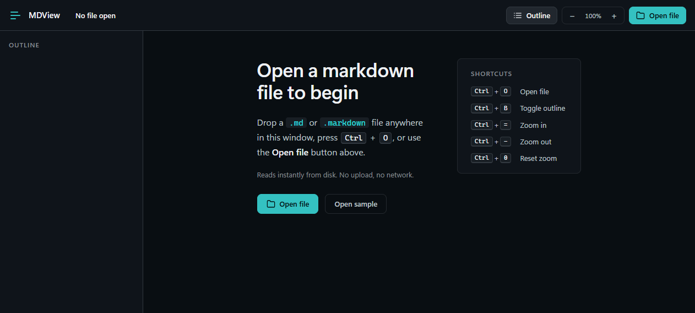
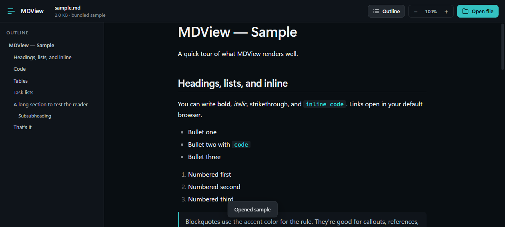

# MDView

A small, fast, native **Markdown viewer for Windows 11**, built on [Tauri 2](https://v2.tauri.app) and WebView2.

[](https://github.com/your-org/mdview/actions/workflows/ci.yml)
[](LICENSE)
[](https://v2.tauri.app)
[](https://www.rust-lang.org)
[](https://nodejs.org)
[]()




## Highlights

- **~3.6 MB** standalone executable — no Electron, no bundled Chromium.
- Native Windows 11 window with proper title bar, decorations, and drag-and-drop.
- **GFM markdown**: tables, task lists, fenced code, strikethrough, autolinks.
- **Syntax highlighting** for 14+ languages (JS, TS, Python, JSON, Bash, HTML, CSS, Markdown, Rust, Go, SQL, YAML, +aliases).
- **Auto-built outline** from headings, with scroll-spy and click-to-scroll.
- **XSS-safe** rendering via DOMPurify.
- **File association**: `.md`, `.markdown`, `.mdown`, `.mkd`, `.txt` — registered automatically by the MSI/NSIS installer; a portable `.reg` ships for standalone use.
- **Single instance**: opening a second file while MDView is running focuses the existing window and loads the new file.
- **Keyboard first**: `Ctrl+O` open, `Ctrl+B` toggle outline, `Ctrl+=` / `Ctrl+-` / `Ctrl+0` zoom.
- **Accessibility**: focus rings, ARIA labels, `aria-live` toast, `prefers-reduced-motion` honored.
- **Zero network** at runtime. All I/O is local.

## Screenshots

| Empty state | Rendered sample |
|---|---|
|  |  |

## Installation

### From the installer (recommended)

1. Download the latest release from [GitHub Releases](https://github.com/your-org/mdview/releases).
2. Run `MDView_0.1.0_x64-setup.exe` (NSIS) or `MDView_0.1.0_x64_en-US.msi` (Windows Installer).
3. Right-click any `.md` file → **Open with** → MDView.

### Portable (single executable)

1. Download `mdview.exe` from [GitHub Releases](https://github.com/your-org/mdview/releases).
2. Place it anywhere on your `PATH`.
3. *(Optional)* Double-click `register-file-association.reg` from this repo to wire up the `.md` association.
4. Launch: `mdview.exe path\to\file.md` or double-click any `.md` after the reg import.

### From source

```bash
git clone https://github.com/your-org/mdview.git
cd mdview
npm install
npm run build        # produces installers in src-tauri/target/release/bundle/
```

## Usage

| Action | Shortcut |
|---|---|
| Open file | `Ctrl + O` |
| Toggle outline | `Ctrl + B` |
| Zoom in / out | `Ctrl + =` / `Ctrl + -` |
| Reset zoom | `Ctrl + 0` |

You can also:

- **Drag and drop** a `.md` file anywhere into the window.
- **Right-click → Open with → MDView** to launch MDView from Explorer.
- **Click the teal "Open file" button** for the system file picker.

## Tech stack

| Layer | Choice | Why |
|---|---|---|
| Shell | [Tauri 2](https://v2.tauri.app) | Small binary, Rust backend, WebView2 frontend. |
| Frontend | Vanilla ES modules | No framework. ~167 KB JS, fast cold start. |
| Bundler | [esbuild](https://esbuild.github.io) | Sub-second builds, no config. |
| Markdown | [marked](https://marked.js.org) 18 | GFM-correct, fast, AST-free. |
| Sanitize | [DOMPurify](https://github.com/cure53/DOMPurify) 3 | The XSS defense. |
| Highlight | [highlight.js](https://highlightjs.org) 11 | 14 languages bundled, color-tuned. |
| Single instance | tauri-plugin-single-instance 2 | Warm-start handoff. |

See [`docs/design/`](docs/design/) for the design audit history (checkup + smell reports).

## Project layout

```
.
├── index.html              App shell
├── src/
│   ├── main.js             Renderer: markdown, outline, zoom, drag/drop, IPC
│   ├── sample.js           Inlined sample markdown for the empty-state
│   └── styles.css          Design tokens + reader typography
├── scripts/
│   ├── dev-server.mjs      esbuild watcher + static server
│   ├── build-static.mjs    Production bundler
│   ├── gen-icons.mjs       Icon set generator
│   ├── test-bundle.mjs     Frontend smoke test
│   └── test-runtime.mjs    Frontend runtime test (jsdom)
├── docs/                   Design audits + project notes
├── examples/sample.md      Used by tests and the empty-state button
├── register-file-association.reg   Optional portable .reg
├── LICENSE                 MIT
├── CHANGELOG.md
├── CONTRIBUTING.md
├── SECURITY.md
└── src-tauri/
    ├── Cargo.toml
    ├── tauri.conf.json
    ├── build.rs
    ├── capabilities/default.json
    ├── icons/              Generated PNG + ICO
    ├── src/
    │   ├── main.rs
    │   └── lib.rs          Tauri commands + plugins
    └── tests/              Backend integration tests
```

## Development

```bash
npm install
npm run dev            # Tauri window with HMR
```

Frontend only (no Tauri):

```bash
npm run dev:web        # http://127.0.0.1:1420
```

Run the tests:

```bash
npm run test:web                          # marked + DOMPurify + hljs (12 checks)
node scripts/test-runtime.mjs             # bundle runs without runtime crash (9 checks)
cd src-tauri && cargo test                # 3 backend integration tests
```

CI runs all three on every push — see `.github/workflows/ci.yml`.

## Building installers

```bash
npm run build
```

Outputs:

| File | Size |
|---|---|
| `src-tauri/target/release/mdview.exe` | ~3.6 MB |
| `src-tauri/target/release/bundle/msi/MDView_0.1.0_x64_en-US.msi` | ~1.8 MB |
| `src-tauri/target/release/bundle/nsis/MDView_0.1.0_x64-setup.exe` | ~1.3 MB |

## Troubleshooting

**"App didn't start" / blank window**: WebView2 runtime is missing. Install it from [Microsoft](https://developer.microsoft.com/microsoft-edge/webview2/) (preinstalled on Windows 11).

**Right-click → "Open with" doesn't show MDView**: Either run the installer (which registers the association automatically), or import `register-file-association.reg`. If you moved `mdview.exe`, edit the reg file's path before importing.

**Drag-and-drop doesn't work**: Make sure the file is on a local drive. UNC paths and some network shares are blocked by Tauri by default.

## Contributing

See [CONTRIBUTING.md](CONTRIBUTING.md). PRs welcome.

## Security

See [SECURITY.md](SECURITY.md). Please report vulnerabilities via email, not as a public issue.

## License

[MIT](LICENSE)
